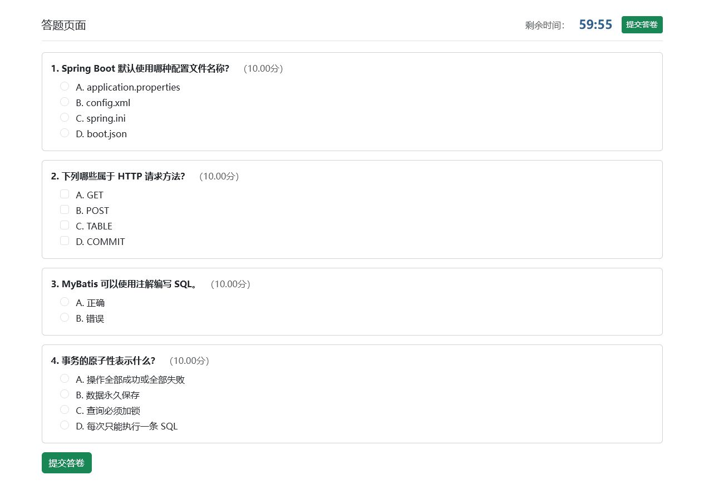
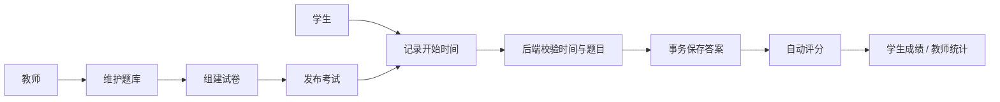

# 校园在线考试系统

> 一个从课程作业持续工程化的 Java Web 项目，覆盖教师组卷、考试管理、学生限时作答、自动评分与成绩统计。

[](https://github.com/Bai-ning-bing-dong/java-test/actions/workflows/ci.yml)


## 项目亮点

- 教师端支持题库、试卷、考试安排和成绩统计，学生端支持注册、限时作答和成绩查询。
- 提交流程由 Spring 事务管理，后端校验考试状态、实际作答时长、题目归属和重复提交。
- 单选、判断、多选题统一评分；多选答案会去重和排序，避免选项顺序影响结果。
- 密码使用 `PBKDF2-HMAC-SHA256` 加盐哈希，老的明文账号在首次成功登录后自动迁移。
- 教师的题目、试卷、考试和课程操作均校验资源所有权，防止通过猜测 ID 操作他人数据。
- 提供 H2 零配置演示环境和 MySQL 初始化脚本，项目克隆后可直接运行。
- Bootstrap 样式本地化，无外网时也能正常展示。

## 界面预览

| 教师题库 | 学生作答 |
| --- | --- |
|  |  |

| 登录页 | 自动评分结果 |
| --- | --- |
|  |  |

## 核心流程



## 技术栈

- Java 21、Spring Boot 4、Spring MVC、Thymeleaf
- MyBatis、MySQL 8、H2 Database
- Bootstrap 5
- JUnit 5、Mockito、Spring Boot Test
- Maven Wrapper

## 快速体验（无需 MySQL）

需要 Java 21。演示 profile 会在内存中初始化 H2 数据库，退出程序后数据自动清除。

```powershell
$env:SPRING_PROFILES_ACTIVE="demo"
.\mvnw.cmd spring-boot:run
```

打开 <http://localhost:8080>：

| 角色 | 账号 | 密码 |
| --- | --- | --- |
| 教师 | `T001` | `123456` |
| 学生 | `S001` | `123456` |

## 连接 MySQL

1. 创建数据库并执行 [`src/main/resources/sql/init.sql`](src/main/resources/sql/init.sql)。注意：该脚本会重建同名表，只用于初次初始化或可抛弃的演示库。
2. 用环境变量传入账号密码：

```powershell
$env:DB_USERNAME="root"
$env:DB_PASSWORD="your-password"
.\mvnw.cmd spring-boot:run
```

默认连接 `localhost:3306/online_exam`，可在 [`application.properties`](src/main/resources/application.properties) 中调整。

## 测试

```powershell
.\mvnw.cmd test
```

当前包含：

- 密码加密与校验测试
- 多选答案归一化测试
- 提交服务的越权题目、超时与事务流程测试
- 基于 H2 的完整作答、评分、及格判定集成测试
- Spring 应用上下文启动测试

## 项目结构

```text
src/main/java/com/exam/online_exam
├── controller/        # 学生、教师与考试请求
├── entity/            # 领域实体
├── mapper/            # MyBatis 数据访问
├── service/           # 事务化提交与评分
└── util/              # 密码和答案工具

src/main/resources
├── sql/               # MySQL / H2 建表与样例数据
├── static/            # 本地 Bootstrap 资源
└── templates/         # Thymeleaf 页面
```

## 设计说明

- 项目保留 MySQL 作为正式运行数据库，H2 只服务于零配置演示和集成测试。
- 服务器时间才是考试超时判定依据，前端倒计时仅用于交互提示。
- `exam_result` 使用学号和考试 ID 作为联合主键，数据库约束与服务层校验共同防止重复提交。

## 后续计划

- 引入 Spring Security 与基于角色的访问控制
- 增加题库分页、随机组卷和 Excel 批量导入
- 增加 Docker Compose、CI 和更完整的 Web 集成测试

---

这个仓库源于学校课程项目，后续补充了安全、数据一致性、可演示性和自动化测试方面的工程实践。
